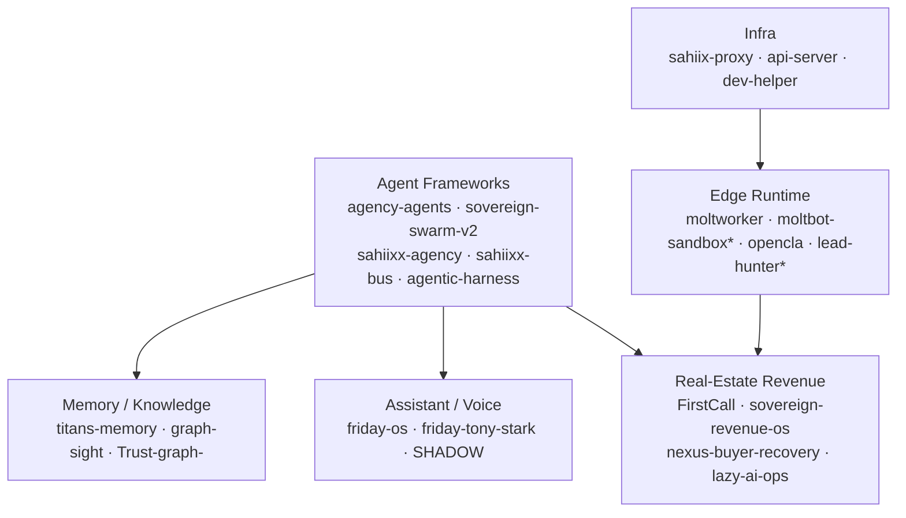

# SAHIIXX

**AI Systems Architect — Dubai, UAE**

I build autonomous agent systems: one operating system of agents, vertical AI products, and the edge infrastructure that runs them.

---

## What I'm building

**An agent operating system.** The runtime layer is `sahiixx-agency` (orchestration) + `sahiixx-bus` (pub/sub mesh) + `agentic-harness` (workflow patterns) + `saas-agent-platform` (multi-tenant FastAPI). `agency-agents` and `sovereign-swarm-v2` are the swarm lab.

**A Dubai real-estate revenue vertical.** `FirstCall` (idempotent UAE-leads ingestion → FastAPI), `sovereign-revenue-os`, `nexus-buyer-recovery`, `sovereign-agents` and `lazy-ai-ops` run the pipeline: capture → qualify → geo-match → schedule → report. Mostly private — this is the commercial side.

**A personal assistant with voice + memory.** `friday-os` (LiveKit voice + Tauri + MCP) backed by `sahiixx-titans-memory` and `sahiixx-graph-sight` for persistence and knowledge.

**An edge runtime on Cloudflare.** 9 Workers (`moltbot-sandbox*`, `lead-hunter*`, `opencla`, `f`) and 4 Pages apps — cheap, always-on entry points for agents.

---

## How it connects

---

## Live surfaces

| Surface | URL | Status |
|---|---|---|
| Portfolio | [sahiix-portfolio.pages.dev](https://sahiix-portfolio.pages.dev) | live |
| SAHIIXX OS | [sahiixx-os.pages.dev](https://sahiixx-os.pages.dev) | live |
| Systems panel | [sahiix-systems.pages.dev](https://sahiix-systems.pages.dev) | live |

Edge: 9 Workers · 4 Pages · 3 R2 · 1 KV · 1 Queue.

---

## By the numbers

- **240 repos** — 94 originals + 146 forks · 218 public / 22 private · 31 stars
- **Top languages** — Python · TypeScript · JavaScript · HTML · Go · Rust · Kotlin
- **Open source** — 332 merged PRs, mostly kept green by automation

Counts from a read-only scrape of this account, 2026-09-19.

---

## Currently

- Hardening the **FirstCall** lead pipeline (capture → qualify → geo-match → revenue)
- Unifying the agent mesh around `sahiixx-bus`
- Consolidating the repo estate (archiving placeholders, merging duplicate sandboxes)

## Reach me

[Portfolio](https://sahiix-portfolio.pages.dev) · or open an issue on any repo.
