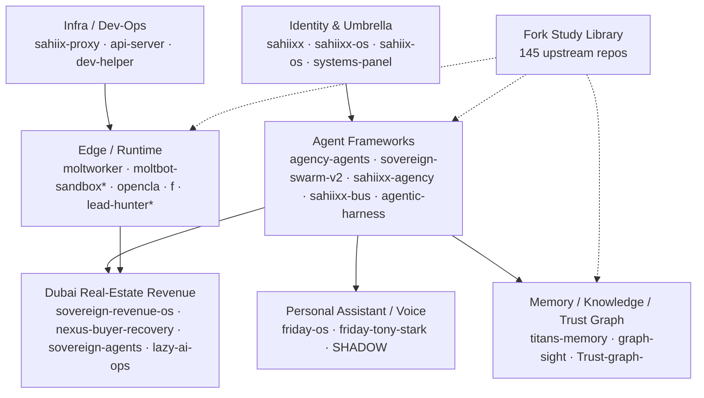

# SAHIIXX — AI Systems Architect

**Dubai, UAE · I design and ship autonomous, agentic systems — an operating system of agents, verticals and edge services.**

-111111?style=flat-square)

> Everything below is grounded in a live read-only scrape of this account (2026-09-15): **238 repos**, an **11-service Cloudflare edge**, and the links between them. Unverifiable marketing numbers were deliberately left out.

---

## The dots, connected

This account is not a pile of repos — it is one system with a clear spine. Three naming threads run through it:

- **`sahiixx` / SAHIIXX OS** — the umbrella and the command centre.
- **`sovereign` · `nexus` · `lead-machine`** — the Dubai real-estate revenue vertical.
- **`friday` · `moltbot` · `openclaw`** — the personal-assistant + edge-runtime lineage.

---

## What I'm actually building

**1. An agent operating system.** `sahiixx-agency` (orchestration) + `sahiixx-bus` (pub/sub mesh) + `agentic-harness` (workflow patterns) + `saas-agent-platform` (multi-tenant FastAPI) are the runtime layer. `agency-agents` and `sovereign-swarm-v2` are the swarm lab.

**2. A Dubai real-estate revenue vertical.** `sovereign-revenue-os`, `nexus-buyer-recovery`, `sovereign-agents` and `lazy-ai-ops` implement the pipeline: capture → qualify → geo-match → schedule → report. Mostly **private** — this is the commercial side.

**3. A personal assistant with voice + memory.** `friday-os` (LiveKit voice + Tauri + MCP) with `sahiixx-titans-memory` and `sahiixx-graph-sight` as the persistence and knowledge layers.

**4. An edge runtime on Cloudflare.** Agents need cheap, always-on entry points: 9 Workers (`moltbot-sandbox*`, `lead-hunter*`, `opencla`, `f`) and 4 Pages apps shipping the user-facing surfaces.

---

## Stack layers

| Layer | What | Repos |
|---|---|---|
| **Experience** | dashboards & sites | `sahiixx-os`, `sahiix-portfolio`, `systems-panel`, `sahiix-os-docs` |
| **Agent runtime** | orchestration & mesh | `sahiixx-agency`, `sahiixx-bus`, `sovereign-swarm-v2`, `agency-agents` |
| **Harness / patterns** | reusable agentic patterns | `agentic-harness`, `agentic-harness-integration`, `saas-agent-platform` |
| **Verticals** | revenue systems | `sovereign-revenue-os`, `nexus-buyer-recovery`, `sovereign-agents`, `lazy-ai-ops` |
| **Assistant** | voice + memory | `friday-os`, `friday-tony-stark`, `SHADOW` |
| **Memory / knowledge** | state & graphs | `sahiixx-titans-memory`, `sahiixx-graph-sight`, `Trust-graph-`, `racx-reflection-pipeline` |
| **Edge** | Workers & Pages | `moltworker`, `moltbot-sandbox*`, `opencla`, `f`, `lead-hunter*` |
| **Integration** | n8n · MCP · scrapers | `sahiixx-geoflow-agent`, `ca-firecrawl`, `ocr-playbook-scanner` |

---

## Originals (93) — by cluster

- **Identity / umbrella (6):** `sahiixx`, `sahiixx-os`, `sahiix-os`, `systems-panel`, `app`, `open`
- **Agent frameworks & orchestration (16):** `agency-agents`, `sovereign-swarm-v2`, `sahiixx-agency`, `sahiixx-bus`, `saas-agent-platform`, `agentic-harness`, `agentic-harness-integration`, `sahiix-agi`, `sahiixx-clearwing`, `agents-for-multi-agent-systems`, `Coral-BlackboxAI-Agent`, `sahiixx-geoflow-agent`, `Genxai`, `codex-self`, `kimi-core`, `sahiixx-bus-backup`
- **Dubai real-estate revenue (11):** `sovereign-revenue-os`, `nexus-buyer-recovery`, `sovereign-agents`, `sovereign-prompt-pack`, `lazy-ai-ops`, `sahiix-os-docs`, `sahiix-portfolio`, `ae-lead-scraper---`, `campaigns`, `UAE-deal-`, `v0-nowire-os-blueprint`
- **Memory / knowledge / trust graph (12):** `sahiixx-titans-memory`, `sahiixx-graph-sight`, `Trust-graph-`, `racx-reflection-pipeline`, `docs`, `mintlify-docs`, `ca-context7`, …
- **Personal assistant / voice (4):** `friday-os`, `friday-tony-stark`, `SHADOW`, `goose-aios`
- **Edge / runtime (6):** `moltworker`, `moltbot-sandbox`, `moltbot-sandboxt`, `moltbot-sandboxuu`, `opencla`, `f`
- **Infra / dev-ops (5):** `sahiix-proxy`, `api-server`, `dev-helper`, `dev-test`, `myproject`
- **Templates / scaffolds (11):** `nextjs*`, `react-router-starter-template`, `containers-template`, `workflows-starter-template`, `v0-*`, …
- **Hygiene / placeholders (13):** `H`, `Bag`, `7`, `mbjv`, `X`, `XXX`, … → **archiving candidates**

---

## Fork study library (145)

I keep upstream code close so I can move fast and stay current. Grouped by what each cluster teaches:

| Family | Count | Examples |
|---|---|---|
| OpenAI official samples & realtime | 17 | `openai-agents-python`, `openai-realtime-agents`, `openai-cookbook`, `codex`, `privacy-sandbox-*` |
| Agent frameworks (upstream) | 22 | `autogen`, `langchain`, `langflow`, `deer-flow`, `goose`, `browser-use`, `OpenManus`, `claude-agent-sdk-python`, `swarm` |
| Reference / awesome lists | 31 | `build-your-own-x`, `public-apis`, `the-book-of-secret-knowledge`, `system_prompts_leaks`, `ollama`, `node` |
| LLM app / data tooling | 15 | `lobe-chat`, `Perplexica`, `airllm`, `Stirling-PDF`, `Real-Time-Voice-Cloning`, `llama-cookbook` |
| Android / Kotlin / mobile | 12 | `voice-quickstart-android`, `pocketpal-ai`, `Valdi`, `SophiApp`, `android-sms-gateway` |
| MCP & tooling | 10 | `openclaw`, `chrome-devtools-mcp`, `workers-sdk`, `servers`, `skills`, `registry`, `clawhub` |
| n8n workflow ecosystem | 7 | `n8n`, `activepieces`, `ultimate-n8n-ai-workflows`, `awesome-n8n-templates` |
| Kimi / Moonshot | 7 | `Kimi-K2`, `Kimi-VL`, `kimi-agent-sdk`, `kimi-cli`, `MoonshotAI-Cookbook` |
| Qwen / ModelScope | 4 | `Qwen3-VL`, `Qwen3-Omni`, `modelscope`, `ms-swift` |
| Other / curated | 20 | `UI-TARS-desktop`, `rasa`, `adk-python`, `llm-council`, `500-AI-Agents-Projects` |

---

## Surfaces

All four Pages projects on the account, with their status at the time of writing:

| Surface | URL | Status (2026-09-15) |
|---|---|---|
| Portfolio | [sahiix-portfolio.pages.dev](https://sahiix-portfolio.pages.dev) | HTTP 200 · live |
| SAHIIXX OS | [sahiixx-os.pages.dev](https://sahiixx-os.pages.dev) | HTTP 200 · live |
| Systems panel | [sahiix-systems.pages.dev](https://sahiix-systems.pages.dev) | HTTP 200 · live |
| 500 AI Agents projects | [500-ai-agents-projects.pages.dev](https://500-ai-agents-projects.pages.dev) | unreachable (HTTP 522→523) · not resolving |

Edge: 9 Cloudflare Workers · 3 R2 buckets · 1 KV (`sahiixx-os-memory`) · 1 Queue.

## Not captured (and why)

Honest gaps, so nothing is quietly missing:

- **Notion** and **Vercel** — connected/registered, but their MCP tools are not available to the scrape session and the CLI needs interactive OAuth. **Zero content read** from either.
- **Fork parents** — GitHub repo search does not expose the parent, so fork grouping is family-level, not exact lineage.
- **Unmatched live resources** — `lead-hunter`, `lead-hunter-simple`, `moltbot-sandboxh`, `moltbot-sandboxu`, `nvc`, `gudgg25` have no repo in the snapshot (deployed from local/unversioned code).

---

## By the numbers (scraped 2026-09-15)

- **238 repos total** — 93 originals (72 public / 21 private) + 145 forks
- **Top languages** — Python 72 · TypeScript 65 · JavaScript 14 · HTML 11 · Rust 8 · Go 8
- **Cloudflare edge** — 9 Workers · 4 Pages · 3 R2 · 1 KV · 1 Queue · 0 DNS zones
- **Open source footprint** — 332 merged PRs, mostly kept green by automation

---

## Currently focused on

- Hardening the **Lead Machine** real-estate pipeline (capture → qualify → geo-match → revenue).
- Unifying the agent mesh around `sahiixx-bus`.
- Consolidating the repo estate (archiving placeholder repos, merging duplicate sandboxes).

## Reach me

- Portfolio → [sahiix-portfolio.pages.dev](https://sahiix-portfolio.pages.dev)
- Or open an issue on any repo above.

Profile generated from a read-only connector scrape (GitHub + Cloudflare). Counts are fork-inclusive.
