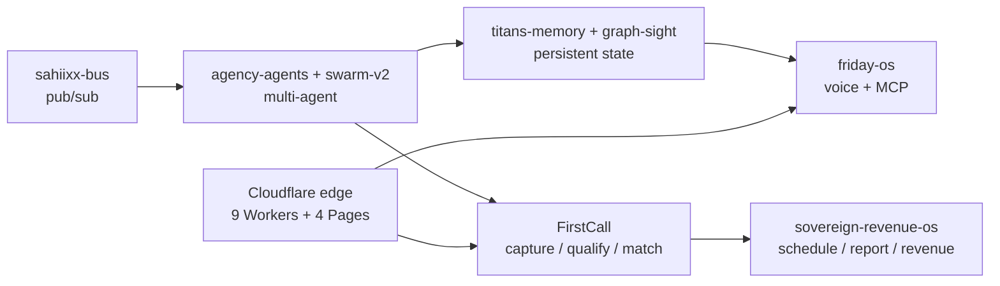

# SAHIIXX

### Agentic AGI — end to end · Dubai, UAE

*I build production agent systems, not demos. One operating system of agents, memory, voice, verticals and edge — running, healing and earning in real time.*

---

## ⚡ Live operating picture

> Auto-refreshed every 6h by an on-machine agent + GitHub Action. Machine state as of **2026-09-22**; repo stats pulled at render time.

| Signal | State |
|---|---|
| 🛰️ Hermes gateway | `running` · Telegram `connected` |
| 🩺 Self-healing watchdog | 6 services supervised · auto-remediation on |
| 🏢 FirstCall revenue pipeline | 4,565 leads · 1,907 deals · 4,911 outreach · 0 open links |
| ☁️ Cloudflare edge | 9 Workers · 4 Pages · 3 R2 · 1 KV · 1 Queue |
| 📈 GitHub activity (30d) | 69 pushes · 18 PRs · 12 repos created |
| ⭐ Research library | 306 starred repos — the state of the art, mapped |

---

## 🧠 Live AI/AGI stack

The substrate I run against daily — frontier APIs, open reasoning models, local inference, agent runtimes, orchestration and routing:

| Layer | Toolkit |
|---|---|
| **Frontier APIs** | Claude · GPT · Gemini · Kimi (Moonshot) |
| **Open / reasoning** | DeepSeek · Qwen · GLM · Nemotron |
| **Local inference** | GGUF + `llama-server` (offline, byte-verified) |
| **Agent runtimes** | Cline · Hermes · IronClaw/Reborn · OpenClaw |
| **Orchestration** | MCP servers · `sahiixx-bus` mesh · n8n |
| **Routing** | TokenRouter · Cline gateway · AgentRouter |

---

## 🏗️ End-to-end agentic systems

**Agent OS.** `sahiixx-agency` (orchestration) + `sahiixx-bus` (pub/sub mesh) + `agentic-harness` (workflow patterns) + `saas-agent-platform` (multi-tenant FastAPI). Swarm lab: `agency-agents` + `sovereign-swarm-v2`.

**Revenue vertical (Dubai real estate).** `FirstCall` (idempotent ingestion → FastAPI), `sovereign-revenue-os`, `nexus-buyer-recovery`, `sovereign-agents`, `lazy-ai-ops`: capture → qualify → geo-match → schedule → report.

**Assistant + memory.** `friday-os` (LiveKit voice + Tauri + MCP) persisted by `sahiixx-titans-memory` + `sahiixx-graph-sight`.

**Edge runtime.** 9 Cloudflare Workers + 4 Pages apps — cheap, always-on agent entry points.

---

## 🔗 Execution graph — idea to revenue

---

## 🧪 Proof, not promises — flagship systems

Stars, language and last push come straight from the GitHub API at render time.

| System | What it proves | Lang | Stars | Pushed |
|---|---|---|---|---|
| [agency-agents](https://github.com/sahiixx/agency-agents) | Flagship multi-agent swarm lab | Python | 2 | 2026-09-17 |
| [friday-os](https://github.com/sahiixx/friday-os) | Voice-first personal AI OS — LiveKit + Tauri + MCP | Python | 2 | 2026-08-10 |
| [sovereign-swarm-v2](https://github.com/sahiixx/sovereign-swarm-v2) | Modular multi-agent OS | Python | 1 | 2026-08-10 |
| [sahiixx-bus](https://github.com/sahiixx/sahiixx-bus) | Unified orchestration bus (pub/sub mesh) | Python | 0 | 2026-08-10 |
| [agentic-harness](https://github.com/sahiixx/agentic-harness) | Agentic workflow patterns (Azure Foundry) | Python | 0 | 2026-08-10 |
| [moltworker](https://github.com/sahiixx/moltworker) | OpenClaw on Cloudflare Workers | JavaScript | 0 | 2026-08-10 |
| [ocr-playbook-scanner](https://github.com/sahiixx/ocr-playbook-scanner) | OCR ingestion utility | Kotlin | 0 | 2026-09-14 |
| [sahiixx-os](https://github.com/sahiixx/sahiixx-os) | Full-stack command center (React + tRPC) | TypeScript | 0 | 2026-09-21 |

Private flagships (FirstCall pipeline, revenue OS) are counted in totals, never exposed.

---

## 🌐 Live surfaces

| Surface | URL | Status |
|---|---|---|
| Portfolio | [sahiix-portfolio.pages.dev](https://sahiix-portfolio.pages.dev) | live |
| SAHIIXX OS | [sahiixx-os.pages.dev](https://sahiixx-os.pages.dev) | live |
| Systems panel | [sahiix-systems.pages.dev](https://sahiix-systems.pages.dev) | live |

---

## 📊 Live footprint

- **195 active public repos** — 48 originals + 147 forks · 30 stars
- **Top languages** — Python · TypeScript · JavaScript · HTML · Go · Rust · Kotlin
- **Community** — 14 followers · 56 following · 306 starred
- **Archive** — 24 placeholder/scaffold repos retired (not counted above)

Auto-generated 2026-09-25 by an on-machine agent + GitHub Action. Every metric is fetched at render time; static text never carries a number.

---

## 🎯 Building next

- Hardening the **FirstCall** lead pipeline (capture → qualify → geo-match → revenue)
- Unifying the agent mesh around `sahiixx-bus`
- Consolidating the estate (archived placeholders already removed)

## 📬 Reach me

[Portfolio](https://sahiix-portfolio.pages.dev) · or open an issue on any repo.
