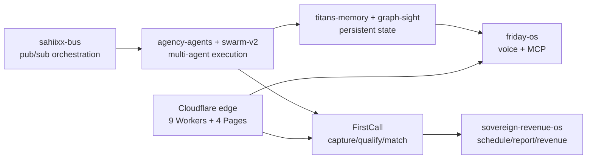

# SAHIIXX

### Agentic AGI, end to end — Dubai, UAE

*I ship production agent systems, not demos: orchestration, memory, voice, verticals, edge.*

---

## ⚡ Live operating picture

> Refreshed every 6h by an on-machine agent + GitHub Action. Last update: **2026-09-19**.

| System | State |
|---|---|
| 🛰️ Hermes gateway | `running` · Telegram `connected` |
| 🩺 Self-healing watchdog | 6 services supervised · auto-remediation on |
| 🏢 FirstCall revenue pipeline | 4,565 leads · 1,907 deals · 4,911 outreach · 0 open links |
| ☁️ Cloudflare edge | 9 Workers · 4 Pages · 3 R2 · 1 KV · 1 Queue |
| 📈 GitHub activity, trailing 30d | 54 pushes · 18 PRs · 17 repos created |

---

## 🧠 Live AI/AGI stack I run against

Models, runtimes, and routing I use daily — the substrate behind everything below:

| Layer | Providers / models |
|---|---|
| **Frontier APIs** | Claude · GPT · Gemini · Kimi (Moonshot) |
| **Open / reasoning** | DeepSeek · Qwen · GLM · Nemotron |
| **Local inference** | GGUF + `llama-server` (offline bundle, byte-verified) |
| **Agent runtimes** | Cline · Hermes · IronClaw/Reborn · OpenClaw |
| **Orchestration** | MCP servers · `sahiixx-bus` pub/sub mesh · n8n |
| **Routing** | TokenRouter · Cline gateway · AgentRouter |

---

## 🏗️ End-to-end agentic systems, not demos

**Agent OS.** Runtime layer: `sahiixx-agency` (orchestration) + `sahiixx-bus` (pub/sub mesh) + `agentic-harness` (workflow patterns) + `saas-agent-platform` (multi-tenant FastAPI). `agency-agents` + `sovereign-swarm-v2` are the swarm lab.

**Revenue vertical.** `FirstCall` (idempotent UAE-leads ingestion → FastAPI), `sovereign-revenue-os` (private), `nexus-buyer-recovery`, `sovereign-agents`, `lazy-ai-ops`: capture → qualify → geo-match → schedule → report.

**Assistant + memory.** `friday-os` (LiveKit voice + Tauri + MCP), persisted by `sahiixx-titans-memory` + `sahiixx-graph-sight`.

**Edge runtime.** 9 Workers (`moltbot-sandbox*`, `lead-hunter*`, `opencla`, `f`) + 4 Pages apps — cheap, always-on entry points.

---

## 🔗 Execution graph — idea to revenue

---

## 🧪 Proof, not promises — flagship systems

Stars, languages, and push dates below come straight from the GitHub API at render time.

| System | What it proves | Lang | Stars | Pushed |
|---|---|---|---|---|
| [agency-agents](https://github.com/sahiixx/agency-agents) | Flagship multi-agent swarm | Python | 2 | 2026-09-17 |
| [friday-os](https://github.com/sahiixx/friday-os) | Voice-first personal AI OS, memory-persistent, MCP-powered | Python | 2 | 2026-08-10 |
| [sovereign-swarm-v2](https://github.com/sahiixx/sovereign-swarm-v2) | Modular multi-agent OS | Python | 1 | 2026-08-10 |
| [sahiixx-bus](https://github.com/sahiixx/sahiixx-bus) | Unified orchestration bus | Python | 0 | 2026-08-10 |
| [moltworker](https://github.com/sahiixx/moltworker) | Cloudflare Workers edge runtime | JavaScript | 0 | 2026-08-10 |
| [ocr-playbook-scanner](https://github.com/sahiixx/ocr-playbook-scanner) | OCR ingestion utility | Kotlin | 0 | 2026-09-14 |

Private flagships (FirstCall ingestion pipeline, vertical revenue OS) are counted in the totals, never exposed.

---

## 🌐 Live surfaces

Deployed Pages on this account — links resolve at render time:

| Surface | URL | Status |
|---|---|---|
| Portfolio | [sahiix-portfolio.pages.dev](https://sahiix-portfolio.pages.dev) | live |
| SAHIIXX OS | [sahiixx-os.pages.dev](https://sahiixx-os.pages.dev) | live |
| Systems panel | [sahiix-systems.pages.dev](https://sahiix-systems.pages.dev) | live |

---

## 📊 Live footprint

- **219 public repos** — 72 originals + 147 forks · 30 stars
- **Top languages** — Python · TypeScript · JavaScript · HTML · Go · Rust · Kotlin
- **Open source** — automation-kept PRs across the fork study library

Auto-generated 2026-09-20 by an on-machine agent + GitHub Action from the GitHub API and local machine state. Every number above is fetched at render time; static text never carries metrics.

---

## 🎯 Building next

- Hardening the **FirstCall** lead pipeline (capture → qualify → geo-match → revenue)
- Unifying the agent mesh around `sahiixx-bus`
- Consolidating the repo estate (archiving placeholders, merging duplicate sandboxes)

## 📬 Reach me

[Portfolio](https://sahiix-portfolio.pages.dev) · or open an issue on any repo.
