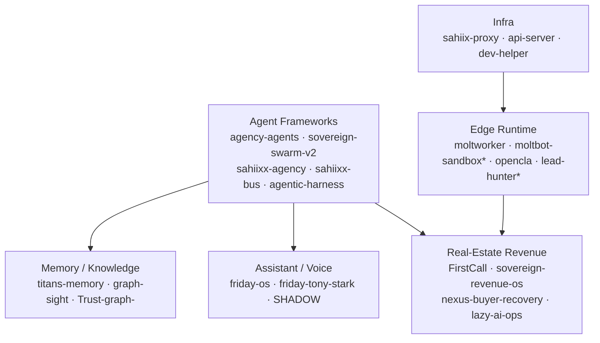

# SAHIIXX

### AI Systems Architect — Dubai, UAE

*Building an operating system of autonomous agents — from edge runtime to revenue verticals.*

---

## ⚡ Live now

> Auto-refreshed every 6h by a local agent + GitHub Action. Last update: **2026-09-19**.

| Signal | State |
|---|---|
| 🛰️ **Hermes gateway** | `running` · Telegram `connected` |
| 🩺 **Self-healing watchdog** | 6 services supervised · auto-remediation on |
| 🏢 **FirstCall pipeline** | 4,565 leads · 1,907 deals · 4,911 outreach · 0 orphans |
| ☁️ **Cloudflare edge** | 9 Workers · 4 Pages · 3 R2 · 1 KV · 1 Queue |
| 📈 **GitHub pulse (30d)** | 54 pushes · 18 PRs · 17 repos created |

---

## 🧠 AI / AGI stack — what I run against

Live models, agents and infra I build with daily:

| Layer | Providers / models |
|---|---|
| **Frontier APIs** | Claude · GPT · Gemini · Kimi (Moonshot) |
| **Open / reasoning** | DeepSeek · Qwen · GLM · Nemotron |
| **Local inference** | GGUF + `llama-server` (offline bundle, byte-verified) |
| **Agent runtimes** | Cline · Hermes · IronClaw/Reborn · OpenClaw |
| **Orchestration** | MCP servers · `sahiixx-bus` pub/sub mesh · n8n |
| **Routing** | TokenRouter · Cline gateway · AgentRouter |

---

## 🏗️ What I'm building

**An agent operating system.** The runtime layer is `sahiixx-agency` (orchestration) + `sahiixx-bus` (pub/sub mesh) + `agentic-harness` (workflow patterns) + `saas-agent-platform` (multi-tenant FastAPI). `agency-agents` and `sovereign-swarm-v2` are the swarm lab.

**A Dubai real-estate revenue vertical.** `FirstCall` (idempotent UAE-leads ingestion → FastAPI), `sovereign-revenue-os`, `nexus-buyer-recovery`, `sovereign-agents` and `lazy-ai-ops` run the pipeline: capture → qualify → geo-match → schedule → report. Mostly private — this is the commercial side.

**A personal assistant with voice + memory.** `friday-os` (LiveKit voice + Tauri + MCP) backed by `sahiixx-titans-memory` and `sahiixx-graph-sight` for persistence and knowledge.

**An edge runtime on Cloudflare.** 9 Workers (`moltbot-sandbox*`, `lead-hunter*`, `opencla`, `f`) and 4 Pages apps — cheap, always-on entry points for agents.

---

## 🔗 How it connects

---

## 🌐 Live surfaces

| Surface | URL | Status |
|---|---|---|
| Portfolio | [sahiix-portfolio.pages.dev](https://sahiix-portfolio.pages.dev) | 🟢 live |
| SAHIIXX OS | [sahiixx-os.pages.dev](https://sahiixx-os.pages.dev) | 🟢 live |
| Systems panel | [sahiix-systems.pages.dev](https://sahiix-systems.pages.dev) | 🟢 live |

---

## 📊 By the numbers

- **218 public repos** — 72 originals + 146 forks · 30 stars
- **Top languages** — Python · TypeScript · JavaScript · HTML · Go · Rust · Kotlin
- **Open source** — 332 merged PRs, mostly kept green by automation

Auto-generated 2026-09-19 by a local agent + GitHub Action from live GitHub / Cloudflare / machine state.

---

## 🎯 Currently

- Hardening the **FirstCall** lead pipeline (capture → qualify → geo-match → revenue)
- Unifying the agent mesh around `sahiixx-bus`
- Consolidating the repo estate (archiving placeholders, merging duplicate sandboxes)

## 📬 Reach me

[Portfolio](https://sahiix-portfolio.pages.dev) · or open an issue on any repo.
