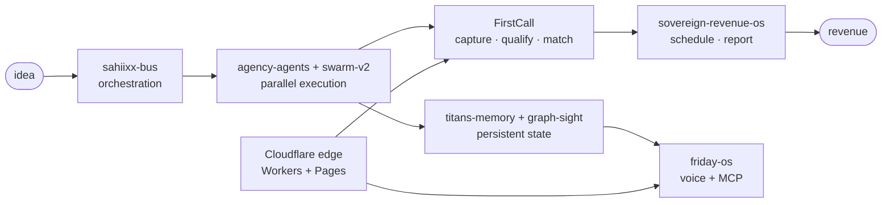

# SAHIIXX

### Agentic AGI, end to end

Dubai, UAE — I build the parts other people demo.

---

## ⚡ Live operating picture

> Sensed on the machine, published by a local agent, rendered by GitHub Actions. Last pulse **2026-09-19**.

| Instrument | Reading |
|---|---|
| 🛰️ Gateway | `running` · Telegram `connected` |
| 🩺 Supervisor | 6 services watched · self-healing armed |
| 🏗️ Pipeline | 4,565 leads · 1,907 deals · 4,911 outreach · 0 broken links |
| ☁️ Edge | 9 Workers · 4 Pages · 3 R2 · 1 KV · 1 Queue |
| 📡 GitHub · 30d | 54 pushes · 18 PRs · 17 repos created |

---

## 🌐 What I run against

The AI/AGI substrate, in production use — not a wishlist:

| Layer | In the rotation |
|---|---|
| **Frontier** | Claude · GPT · Gemini · Kimi (Moonshot) |
| **Open reasoning** | DeepSeek · Qwen · GLM · Nemotron |
| **Local inference** | GGUF + `llama-server` — offline bundle, byte-verified |
| **Agent runtimes** | Cline · Hermes · IronClaw/Reborn · OpenClaw |
| **Protocol layer** | MCP servers · A2A-style pub/sub over `sahiixx-bus` |
| **Orchestration** | autonomous loops · vote gates · audit chains · n8n |
| **Routing** | TokenRouter · Cline gateway · AgentRouter |
| **Voice** | LiveKit + Tauri desktop (`friday-os`) |

---

## 🏗️ End-to-end systems, not demos

**Agent OS.** `sahiixx-bus` (pub/sub mesh) + `sahiixx-agency` (orchestration) + `agentic-harness` (workflow patterns) + `saas-agent-platform` (multi-tenant FastAPI). `agency-agents` and `sovereign-swarm-v2` are the swarm lab.

**Revenue vertical.** `FirstCall` (idempotent UAE-lead ingestion → FastAPI) with `sovereign-revenue-os`, `nexus-buyer-recovery`, `sovereign-agents`, `lazy-ai-ops`: capture → qualify → geo-match → schedule → report. Private by design.

**Assistant + memory.** `friday-os` (LiveKit voice + Tauri + MCP) persisted by `sahiixx-titans-memory` + `sahiixx-graph-sight`; `SHADOW` as the companion runtime.

**Edge runtime.** Workers + Pages + R2 + KV + Queues running agent entry points close to the user, cheap and always-on.

---

## 🔗 Execution graph — idea to revenue

---

## 🧪 Proof, not promises

Stars, languages and push dates are read from the GitHub API on every render — nothing here is typed by hand.

| System | What it proves | Lang | ⭐ | Last push |
|---|---|---|---|---|
| [`agency-agents`](https://github.com/sahiixx/agency-agents) | Flagship multi-agent swarm | Python | 2 | 2026-09-17 |
| [`friday-os`](https://github.com/sahiixx/friday-os) | Voice-first personal AI OS — memory-persistent, MCP-powered | Python | 2 | 2026-08-10 |
| [`sovereign-swarm-v2`](https://github.com/sahiixx/sovereign-swarm-v2) | Modular multi-agent OS | Python | 1 | 2026-08-10 |
| [`sahiixx-bus`](https://github.com/sahiixx/sahiixx-bus) | Unified orchestration bus | Python | 0 | 2026-08-10 |
| [`agentic-harness-integration`](https://github.com/sahiixx/agentic-harness-integration) | Agentic patterns wired to Azure Foundry | Python | 1 | 2026-09-11 |
| [`moltworker`](https://github.com/sahiixx/moltworker) | OpenClaw on Cloudflare Workers | JavaScript | 0 | 2026-08-10 |
| [`ocr-playbook-scanner`](https://github.com/sahiixx/ocr-playbook-scanner) | OCR ingestion utility | Kotlin | 0 | 2026-09-14 |
| [`Genxai`](https://github.com/sahiixx/Genxai) | AgentForge open-core agent micro-SaaS scaffold | - | 0 | 2026-08-21 |

Private flagships (the ingestion pipeline and revenue OS) count toward the totals above but stay closed-source.

---

## 📚 Research library — 307 repos tracked

I star what I intend to out-build. The library is the leading indicator; the repos above are the delivery.

| What the library covers | Why it matters |
|---|---|
| Multi-agent frameworks & harnesses | the swarm patterns behind `agency-agents` |
| Model runtimes & inference internals | what makes `llama-server` + GGUF viable |
| MCP servers & tool protocols | the 80+ connectors in `integrations` |
| Voice, speech & realtime audio | the LiveKit stack inside `friday-os` |
| Scraping, OSINT & data plumbing | how `FirstCall` keeps its lead graph fresh |
| Edge & serverless runtimes | the Workers deployment model |

---

## 🌐 Live surfaces

| Surface | URL |
|---|---|
| Portfolio | [sahiix-portfolio.pages.dev](https://sahiix-portfolio.pages.dev) |
| SAHIIXX OS | [sahiixx-os.pages.dev](https://sahiixx-os.pages.dev) |
| Systems panel | [sahiix-systems.pages.dev](https://sahiix-systems.pages.dev) |

---

## 📊 Footprint

- **213 active repos** — 66 originals + 147 forks · 195 public / 18 private · 31 stars
- **Top languages** — Python · TypeScript · JavaScript · HTML · Rust · Go · Kotlin
- **Research library** — 307 starred repos

Rendered 2026-09-20 by an on-machine agent feeding GitHub Actions. Sensed values, not marketing values.

---

## 🎯 Building next

- Hardening the **FirstCall** pipeline: capture → qualify → geo-match → revenue
- Unifying every agent behind `sahiixx-bus`
- Promoting validated prototypes out of the private estate

## 📬 Reach me

[Portfolio](https://sahiix-portfolio.pages.dev) · or open an issue on any repo above.
