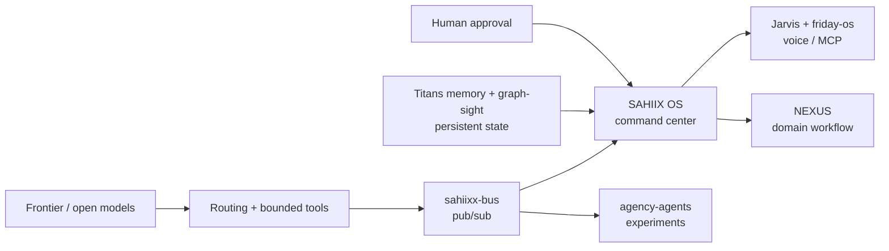

# SAHIIXX

### AI systems architect · model-agnostic agent runtimes · Dubai, UAE

*I build the layer where models meet real software: routing, bounded tools, persistent state, human gates, live interfaces and domain workflows.*

---

## ⚡ Current operating picture

> Snapshot: **2026-10-07**. Repository counts are GitHub inventory data; product states are labeled from project evidence and public surfaces, not inferred from model capability.

| Signal | Evidence-backed state |
|---|---|
| 🧭 Repository estate | 223 public repositories · 51 unarchived originals · 148 unarchived forks · 24 archived |
| 🧠 Orchestration | `sahiixx-agency`, `agentic-harness`, `sahiixx-bus` and the swarm experiments |
| 🖥️ Public OS surface | [SAHIIX OS](https://sahiixx-os.pages.dev) · React/Hono/tRPC/Drizzle/Neon/Cloudflare |
| 🎙️ Voice + tools | [Jarvis](https://sahiixx-os.pages.dev/jarvis) route plus [`friday-os`](https://github.com/sahiixx/friday-os) |
| 🏢 Domain workflow | NEXUS real-estate lead flow · local/pilot boundary documented in the portfolio repo |
| 🧪 Model verification | [`sahiixx-e2e`](https://github.com/sahiixx/sahiixx-e2e) covers traditional, generative and foundation-model capability lanes |
| 🧪 Verification rule | `live` means a reachable or documented running surface; `shipped` means code exists; `in-dev` and `concept` stay labeled |

---

## 📡 Operational pulse

> Machine-reported snapshot: **2026-10-07**. These figures are telemetry from the published local state file, not product-performance guarantees.

| Signal | Snapshot |
|---|---|
| Gateway | `running` · Telegram `connected` · `9` watchdog services |
| Firstcall pipeline | `4025` leads · `1111` deals · `2786` outreach events · `0` orphans |
| Edge estate | `9` Workers · `4` Pages · `3` R2 · `1` KV · `1` queues |
| GitHub activity, 30 days | `153` pushes · `57` PRs · `49` repositories created |

---

## 🧠 AI frontier map — grounded, not hype

The current AI stack is moving from single-turn generation toward reasoning modes, tool use, memory, multimodality, agents and embodied interfaces. My work is the systems layer around those capabilities.

| Area | Current evidence | How I frame it |
|---|---|---|
| Frontier models | [OpenAI research](https://openai.com/research/), [Anthropic Claude 4](https://www.anthropic.com/news/claude-4), [Google DeepMind models](https://deepmind.google/models/) | Providers publish increasingly capable reasoning, coding, tool and multimodal systems; the application still needs routing, permissions and verification. |
| Open and local models | [Qwen3](https://qwenlm.github.io/blog/qwen3/) and local GGUF/Ollama workflows | Open weights, controllable thinking budgets and local inference are useful for cost, privacy and fallback paths. |
| AGI | [OpenAI Charter](https://openai.com/charter/) defines AGI as highly autonomous systems that outperform humans at most economically valuable work | AGI is a research target and contested definition, not a capability claim made by this profile or these repositories. |
| ASI | [Frontier safety research](https://deepmind.google/frontier-safety/) | ASI is a future-risk and governance horizon; no deployed SAHIIX system is represented as superintelligent. |

**Position:** build useful, auditable agent systems now; keep AGI and ASI claims falsifiable, sourced and separate from shipped product status.

---

## 🏗️ End-to-end systems

**Orchestration.** [`sahiixx-agency`](https://github.com/sahiixx/sahiixx-agency) provides a dispatcher surface, [`agentic-harness`](https://github.com/sahiixx/agentic-harness) documents bounded agent patterns and Azure Foundry routing, and [`sahiixx-bus`](https://github.com/sahiixx/sahiixx-bus) supplies the pub/sub seam.

**Assistant + memory.** [`friday-os`](https://github.com/sahiixx/friday-os) combines voice, desktop and MCP; [`sahiixx-titans-memory`](https://github.com/sahiixx/sahiixx-titans-memory) and [`sahiixx-graph-sight`](https://github.com/sahiixx/sahiixx-graph-sight) explore persistent and graph-backed state.

**Operator shell.** [`sahiixx-os`](https://github.com/sahiixx/sahiixx-os) is the public command center; Jarvis adds streaming voice with read, mutate and confirmation-gated tool tiers.

**Domain vertical.** NEXUS connects Dubai real-estate intake, ranking, WhatsApp and OS import paths. The portfolio marks local workstation services and pilot boundaries explicitly; planned specialist lead agents are not described as live until they exist.

---

## 🧭 Capability map

| Layer | Capability | Representative projects |
|---|---|---|
| Model layer | Traditional rules, generative models, embeddings, structured output and vision | [`sahiixx-e2e`](https://github.com/sahiixx/sahiixx-e2e), [`agentic-harness`](https://github.com/sahiixx/agentic-harness) |
| Runtime layer | Routing, bounded workflows, retries, evaluation, memory and human approval | [`sahiixx-agency`](https://github.com/sahiixx/sahiixx-agency), [`sovereign-swarm-v2`](https://github.com/sahiixx/sovereign-swarm-v2) |
| Protocol layer | Event envelopes, pub/sub, MCP, A2A and gateway bridges | [`sahiixx-bus`](https://github.com/sahiixx/sahiixx-bus), [`moltworker`](https://github.com/sahiixx/moltworker) |
| Intelligence layer | Persistent memory, graph context, retrieval and semantic routing | [`sahiixx-titans-memory`](https://github.com/sahiixx/sahiixx-titans-memory), [`sahiixx-graph-sight`](https://github.com/sahiixx/sahiixx-graph-sight) |
| Product layer | Voice, desktop, web command center and domain workflows | [`friday-os`](https://github.com/sahiixx/friday-os), [`sahiixx-os`](https://github.com/sahiixx/sahiix-os), NEXUS |
| Delivery layer | Contract-first E2E, CI gates, edge deployment and evidence-based security | [`sahiixx-e2e`](https://github.com/sahiixx/sahiixx-e2e), [`sahiixx-production-hardening`](https://github.com/sahiixx/sahiixx-production-hardening), [`sahiixx-clearwing`](https://github.com/sahiixx/sahiixx-clearwing) |

---

## 🧪 Model-agnostic verification

[`sahiixx-e2e`](https://github.com/sahiixx/sahiixx-e2e) is the release-verification boundary for the model layer:

| Lane | What is verified | Default mode |
|---|---|---|
| Traditional | deterministic classification and lead scoring | network-free |
| Generative | chat, SSE streaming and tool calls | mocked, with opt-in live canaries |
| Foundation | structured output, embeddings and vision | mocked, with capability-specific live canaries |

The harness uses runtime contracts, bounded timeouts, replayable fixtures, redacted diagnostics and environment-controlled provider/model IDs. A missing live profile skips only that capability; a configured endpoint fails on transport, HTTP or schema errors.

---

## 🧱 Engineering principles

- **Contract-first:** validate events, identities, schemas and service boundaries at runtime.
- **Model-agnostic:** route by capability and constraints; keep provider names in configuration.
- **Deterministic before autonomous:** use rules and fixed fixtures when they solve the task; add agent loops only when measured value justifies them.
- **Bounded by default:** enforce deadlines, retries, tool allowlists, token/cost budgets and replayable idempotency keys.
- **Human-gated actions:** writes, financial actions and production changes require explicit approval paths.
- **Evidence over hype:** distinguish live, shipped, local, in-development and concept work in public documentation.

---

## 🗺️ Start here

| If you want to… | Start with |
|---|---|
| See the public product surface | [SAHIIX OS](https://sahiixx-os.pages.dev) · [portfolio](https://sahiix-portfolio.pages.dev) |
| Understand the architecture | [`CONNECTED_ECOSYSTEM.md`](https://github.com/sahiixx/sahiixx/blob/main/CONNECTED_ECOSYSTEM.md) · [`FOUNDER_SERVICE_ARCHITECTURE.md`](https://github.com/sahiixx/sahiixx/blob/main/FOUNDER_SERVICE_ARCHITECTURE.md) |
| Inspect the full repository map | [`FULL_PORTFOLIO.md`](https://github.com/sahiixx/sahiixx/blob/main/FULL_PORTFOLIO.md) · [`REPO_MAP.md`](https://github.com/sahiixx/sahiixx/blob/main/REPO_MAP.md) |
| Read the evidence-backed case studies | [`CASE_STUDIES.md`](https://github.com/sahiixx/sahiixx/blob/main/CASE_STUDIES.md) |
| See verification in code | [`sahiixx-e2e`](https://github.com/sahiixx/sahiixx-e2e) · [`agentic-harness`](https://github.com/sahiixx/agentic-harness) |
| Collaborate or propose an integration | Open an issue in the relevant repository or reach out through the portfolio |

---

## 🔗 Execution graph

```mermaid
flowchart LR
  MODEL["Frontier / open models"] --> ROUTE["Routing + bounded tools"]
  ROUTE --> BUS["sahiixx-bus<br/>pub/sub"]
  BUS --> OS["SAHIIX OS<br/>command center"]
  BUS --> SWARM["agency-agents<br/>experiments"]
  OS --> VOICE["Jarvis + friday-os<br/>voice / MCP"]
  OS --> NEXUS["NEXUS<br/>domain workflow"]
  MEMORY["Titans memory + graph-sight<br/>persistent state"] --> OS
  HUMAN["Human approval"] --> OS
```

---

## 🧪 Proof, not promises

| System | What the repository or public surface demonstrates | State | Current GitHub signal |
|---|---|---|---|
| [sahiixx-os](https://github.com/sahiixx/sahiixx-os) | Full-stack command center with React, Hono, tRPC, Drizzle and Neon | Public surface | TypeScript · 1 stars · 2026-10-01 |
| [agentic-harness](https://github.com/sahiixx/agentic-harness) | Reusable agent workflow patterns, verification and Azure Foundry routing | Shipped | Python · 2 stars · 2026-10-06 |
| [sahiixx-e2e](https://github.com/sahiixx/sahiixx-e2e) | Contract-first Playwright release gate with traditional, generative and foundation-model lanes | Shipped | TypeScript · 0 stars · 2026-10-07 |
| [sahiixx-agency](https://github.com/sahiixx/sahiixx-agency) | CLI/API/MCP-oriented repository and task dispatch | Shipped/local | Python · 0 stars · 2026-10-06 |
| [sahiixx-bus](https://github.com/sahiixx/sahiixx-bus) | Unified orchestration bus for cross-service events and agent boundaries | Shipped/local | Python · 1 stars · 2026-10-06 |
| [friday-os](https://github.com/sahiixx/friday-os) | Voice-first, memory-persistent personal AI OS with LiveKit, Tauri and MCP | Shipped | Python · 2 stars · 2026-10-05 |
| [sahiixx-production-hardening](https://github.com/sahiixx/sahiixx-production-hardening) | Canonical event, model-routing, bus, revenue and action-gate contracts | Shipped | Python · 0 stars · 2026-10-05 |
| [sahiixx-clearwing](https://github.com/sahiixx/sahiixx-clearwing) | Security verification focused on evidence rather than report volume | Active | Python · 0 stars · 2026-10-05 |
| [agency-agents](https://github.com/sahiixx/agency-agents) | Multi-agent orchestration and swarm experiments | Active experiment | Python · 3 stars · 2026-10-06 |
| [sovereign-swarm-v2](https://github.com/sahiixx/sovereign-swarm-v2) | Modular multi-agent runtime and governance direction | In development | Python · 2 stars · 2026-08-10 |
| [moltworker](https://github.com/sahiixx/moltworker) | OpenClaw gateway patterns on Cloudflare Workers | Shipped experiment | JavaScript · 0 stars · 2026-10-06 |

---

## 🌐 Public surfaces

| Surface | URL | State |
|---|---|---|
| Portfolio | [sahiix-portfolio.pages.dev](https://sahiix-portfolio.pages.dev) | live |
| SAHIIX OS | [sahiixx-os.pages.dev](https://sahiixx-os.pages.dev) | live public surface |
| Systems panel | [sahiix-systems.pages.dev](https://sahiix-systems.pages.dev) | public dashboard |

---

## 🎯 Delivery status

### Completed

- [x] Contract-first E2E release gate with traditional, generative and foundation-model lanes.
- [x] Provider/model configuration kept environment-controlled and source-linked.
- [x] Public architecture map, engineering principles and case studies.
- [x] Core repository taxonomy that separates products, experiments and fork study libraries.

### Remaining release gates

- [ ] Configure reachable OPA and bus environments and pass `REQUIRE_LIVE=1` capture → qualify → match checks.
- [ ] Make lead events durable with an outbox, idempotency, retry/DLQ and trace propagation.
- [ ] Add tenant-isolation, consent, tool-scope and approval-state checks before production scheduling or offers.
- [ ] Run the repository hygiene script with administrative scope, then keep the fork library and archive candidates current.
- [ ] Publish live model canary artifacts once capability-specific provider variables are available.

Top active languages: Python · TypeScript · JavaScript · HTML · Go · Rust · Kotlin · Generated 2026-10-07 by the profile workflow.

## 📬 Reach me

[Portfolio](https://sahiix-portfolio.pages.dev) · [GitHub](https://github.com/sahiixx) · or open an issue on any repo.
