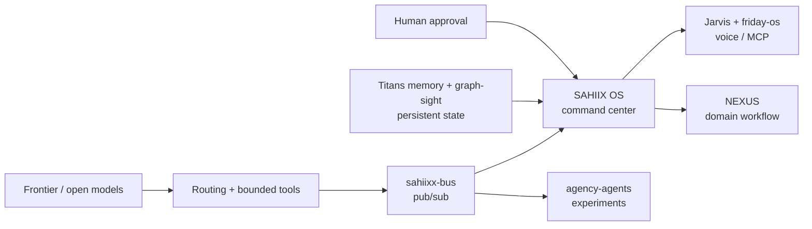

# SAHIIXX

### AI systems architect · agent runtimes, memory, voice and edge · Dubai, UAE

*I build the layer where models meet real software: bounded tools, persistent state, human gates, live interfaces and domain workflows.*

---

## ⚡ Current operating picture

> Snapshot: **2026-10-07**. Repository counts are GitHub inventory data; product states are labeled from project evidence and public surfaces, not inferred from model capability.

| Signal | Evidence-backed state |
|---|---|
| 🧭 Repository estate | 223 public repositories · 51 unarchived originals · 148 unarchived forks · 24 archived |
| 🧠 Orchestration | `sahiixx-agency`, `agentic-harness`, `sahiixx-bus` and the swarm experiments |
| 🖥️ Public OS surface | [SAHIIX OS](https://sahiixx-os.pages.dev) · React/Hono/tRPC/Drizzle/Neon/Cloudflare |
| 🎙️ Voice + tools | [Jarvis](https://sahiixx-os.pages.dev/jarvis) route plus [`friday-os`](https://github.com/sahiixx/friday-os) |
| 🏢 Domain workflow | NEXUS real-estate lead flow · local/pilot boundary documented in the portfolio repo |
| 🧪 Verification rule | `live` means a reachable or documented running surface; `shipped` means code exists; `in-dev` and `concept` stay labeled |

---

## 🧠 AI frontier map — grounded, not hype

The current AI stack is moving from single-turn generation toward reasoning modes, tool use, memory, multimodality, agents and embodied interfaces. My work is the systems layer around those capabilities.

| Area | Current evidence | How I frame it |
|---|---|---|
| Frontier models | [OpenAI research](https://openai.com/research/), [Anthropic Claude 4](https://www.anthropic.com/news/claude-4), [Google DeepMind models](https://deepmind.google/models/) | Providers publish increasingly capable reasoning, coding, tool and multimodal systems; the application still needs routing, permissions and verification. |
| Open and local models | [Qwen3](https://qwenlm.github.io/blog/qwen3/) and local GGUF/Ollama workflows | Open weights, controllable thinking budgets and local inference are useful for cost, privacy and fallback paths. |
| AGI | [OpenAI Charter](https://openai.com/charter/) defines AGI as highly autonomous systems that outperform humans at most economically valuable work | AGI is a research target and contested definition, not a capability claim made by this profile or these repositories. |
| ASI | [Frontier safety research](https://deepmind.google/frontier-safety/) | ASI is a future-risk and governance horizon; no deployed SAHIIX system is represented as superintelligent. |

**Position:** build useful, auditable agent systems now; keep AGI and ASI claims falsifiable, sourced and separate from shipped product status.

---

## 🏗️ End-to-end systems

**Orchestration.** [`sahiixx-agency`](https://github.com/sahiixx/sahiixx-agency) provides a dispatcher surface, [`agentic-harness`](https://github.com/sahiixx/agentic-harness) documents bounded agent patterns and Azure Foundry routing, and [`sahiixx-bus`](https://github.com/sahiixx/sahiixx-bus) supplies the pub/sub seam.

**Assistant + memory.** [`friday-os`](https://github.com/sahiixx/friday-os) combines voice, desktop and MCP; [`sahiixx-titans-memory`](https://github.com/sahiixx/sahiixx-titans-memory) and [`sahiixx-graph-sight`](https://github.com/sahiixx/sahiixx-graph-sight) explore persistent and graph-backed state.

**Operator shell.** [`sahiixx-os`](https://github.com/sahiixx/sahiixx-os) is the public command center; Jarvis adds streaming voice with read, mutate and confirmation-gated tool tiers.

**Domain vertical.** NEXUS connects Dubai real-estate intake, ranking, WhatsApp and OS import paths. The portfolio marks local workstation services and pilot boundaries explicitly; planned specialist lead agents are not described as live until they exist.

---

## 🔗 Execution graph

```mermaid
flowchart LR
  MODEL["Frontier / open models"] --> ROUTE["Routing + bounded tools"]
  ROUTE --> BUS["sahiixx-bus<br/>pub/sub"]
  BUS --> OS["SAHIIX OS<br/>command center"]
  BUS --> SWARM["agency-agents<br/>experiments"]
  OS --> VOICE["Jarvis + friday-os<br/>voice / MCP"]
  OS --> NEXUS["NEXUS<br/>domain workflow"]
  MEMORY["Titans memory + graph-sight<br/>persistent state"] --> OS
  HUMAN["Human approval"] --> OS
```

---

## 🧪 Proof, not promises

| System | What the repository or public surface demonstrates | State | Current GitHub signal |
|---|---|---|---|
| [sahiixx-os](https://github.com/sahiixx/sahiixx-os) | Full-stack command center with React, Hono, tRPC, Drizzle and Neon | Public surface | TypeScript · 1 stars · 2026-10-01 |
| [agentic-harness](https://github.com/sahiixx/agentic-harness) | Reusable agent workflow patterns, verification and Azure Foundry routing | Shipped | Python · 2 stars · 2026-10-06 |
| [sahiixx-agency](https://github.com/sahiixx/sahiixx-agency) | CLI/API/MCP-oriented repository and task dispatch | Shipped/local | Python · 0 stars · 2026-10-06 |
| [friday-os](https://github.com/sahiixx/friday-os) | Voice-first, memory-persistent personal AI OS with LiveKit, Tauri and MCP | Shipped | Python · 2 stars · 2026-10-05 |
| [agency-agents](https://github.com/sahiixx/agency-agents) | Multi-agent orchestration and swarm experiments | Active experiment | Python · 3 stars · 2026-10-06 |
| [sovereign-swarm-v2](https://github.com/sahiixx/sovereign-swarm-v2) | Modular multi-agent runtime and governance direction | In development | Python · 2 stars · 2026-08-10 |
| [moltworker](https://github.com/sahiixx/moltworker) | OpenClaw gateway patterns on Cloudflare Workers | Shipped experiment | JavaScript · 0 stars · 2026-10-06 |

---

## 🌐 Public surfaces

| Surface | URL | State |
|---|---|---|
| Portfolio | [sahiix-portfolio.pages.dev](https://sahiix-portfolio.pages.dev) | live |
| SAHIIX OS | [sahiixx-os.pages.dev](https://sahiixx-os.pages.dev) | live public surface |
| Systems panel | [sahiix-systems.pages.dev](https://sahiix-systems.pages.dev) | public dashboard |

---

## 🎯 Building next

- Make the NEXUS → OPA boundary real before calling specialist lead agents production.
- Keep the agent mesh centered on routing, memory, observability and approval gates.
- Track model/provider changes through primary sources instead of embedding stale model names in product claims.
- Consolidate the repository estate while preserving forks as an explicit research library.

Top active languages: Python · TypeScript · JavaScript · HTML · Go · Rust · Kotlin · Generated 2026-10-06 by the profile workflow.

## 📬 Reach me

[Portfolio](https://sahiix-portfolio.pages.dev) · [GitHub](https://github.com/sahiixx) · or open an issue on any repo.
